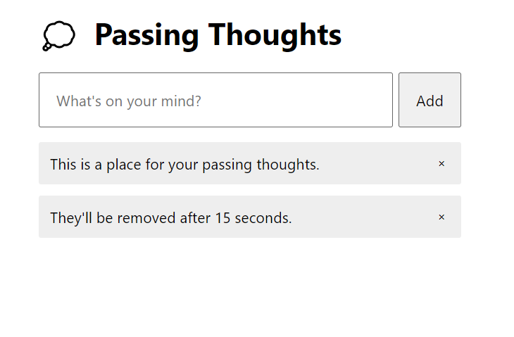

# Passing Thoughts

### What if you could post something and know it wouldn’t live forever?

#### This is a simple project to practice useState and useEffect in react.

##### Once a user add  a short thought, it’ll disappear after just 15 seconds.

##### # passing-thoughts
